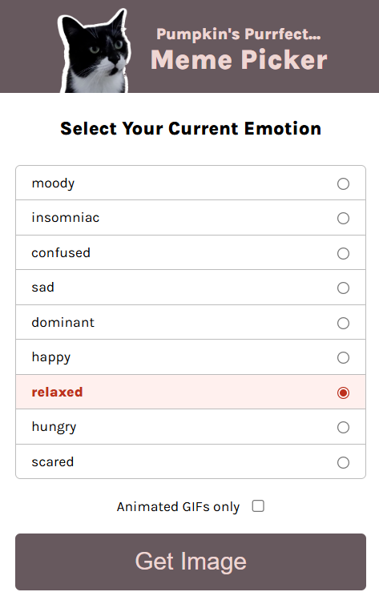
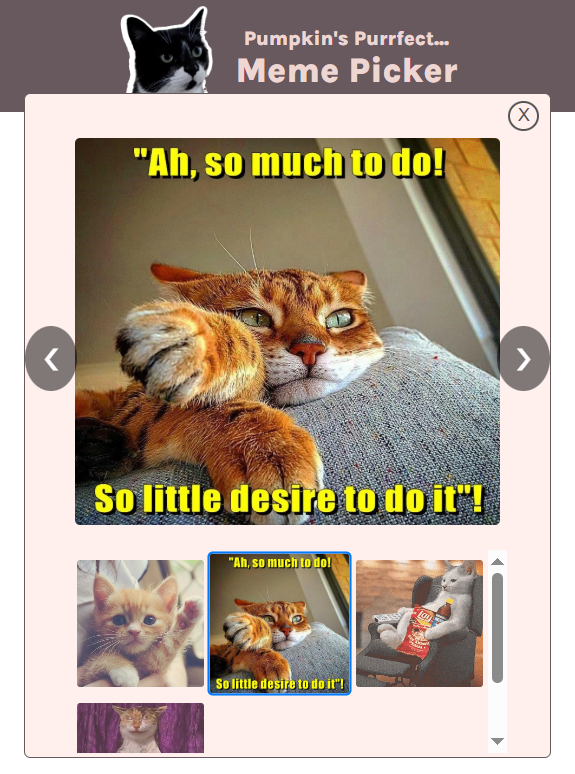

# 🐱 Cat-Themed Meme App (Pumpkin's Meme Picker)

A fun and interactive meme picker app that lets users select their current emotion and view matching cat memes 🐾

This project demonstrates dynamic UI rendering, filtering data, modal interactions, and accessible image gallery navigation using **HTML, CSS, and Vanilla JavaScript**.

---

## 🚀 Live Demo

[View the deployed site here](https://cat-themed-meme-app.netlify.app/)

---

## 📸 Project Screenshots





---

## 📌 Project Overview

This app allows users to:

- Select an emotion from a dynamically generated list
- Optionally filter for GIF-only memes
- View a curated selection of cat memes based on their mood
- Interact with a modal gallery featuring:
  - A main display image
  - Clickable and keyboard-accessible thumbnails

The experience is designed to be simple, playful, and interactive.

---

## 🛠️ Built With

- **HTML5**
- **CSS3**
- **Vanilla JavaScript (ES6 Modules)**
- Google Fonts (Karla)

---

## ✨ Key Features

### 🎭 Dynamic Emotion Filtering

- Emotions are generated dynamically from a data source
- Selecting an emotion enables the “Get Image” button
- Users can filter results based on emotion and GIF preference

### 🧠 Smart Data Handling

- Filters cat data using emotion tags
- Supports conditional filtering for GIF-only content
- Prevents errors by checking for selected inputs

### 🖼️ Interactive Meme Gallery Modal

- Opens a modal displaying the selected meme(s)
- Shows a main image with a grid of thumbnails
- Automatically selects and displays the first match

### 🔄 Thumbnail-Based Navigation

- Clicking a thumbnail or either of the arrow buttons updates the main image
- Active thumbnail is visually highlighted
- Only renders thumbnails when multiple matches exist

### ⌨️ Keyboard Accessibility

- Thumbnails are focusable via the Tab key
- Users can switch images using Enter or Space or ArrowLeft and ArrowRight
- Improves usability and accessibility

### 🎯 UI State Management

- “Get Image” button is disabled until an option is selected
- Selected emotion is visually highlighted
- Active thumbnail state is maintained dynamically

### ❌ Modal Interaction Control

- Modal can be closed via:
  - Close button
  - Clicking outside the modal
- Prevents accidental closing when interacting inside the modal

---

## 🎨 CSS Highlights

- Responsive centered layout
- Flexbox for alignment and structure
- Grid layout for thumbnail gallery
- Smooth hover and focus effects
- Visual feedback for active and selected states
- Styled modal with overlay-like behavior

---

## 🧠 JavaScript Concepts Practiced

- ES6 Modules (`import/export`)
- DOM manipulation
- Event delegation and handling
- Conditional rendering
- Array methods (`filter`, `includes`)
- Dynamic HTML generation
- Accessibility enhancements (keyboard interaction)
- UI state management

---

## 🎯 Learning Outcomes

This project helped reinforce:

- Building dynamic interfaces from data
- Managing UI state effectively
- Creating reusable logic for filtering and rendering
- Handling modals and user interactions
- Improving accessibility in interactive components
- Writing clean, structured JavaScript for real UI behavior

---

## 🔧 How to Run Locally

1. Clone the repository:

```bash
git clone https://github.com/goldenokeama/cat-themed-meme-app.git
```

2. Navigate into the project folder:

```bash
cd cat-meme-app
```

3. Open `index.html` in your browser.
